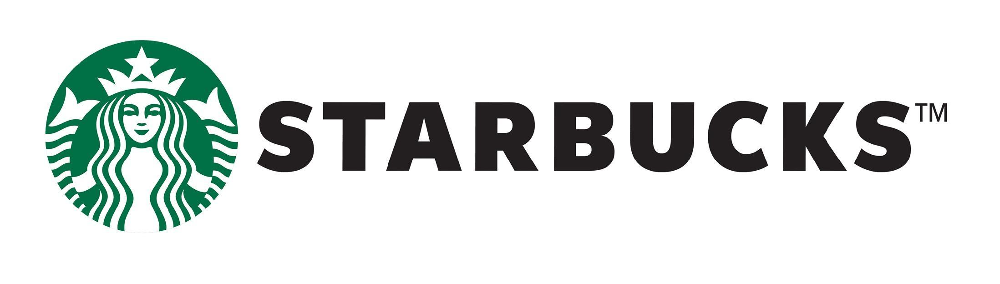

## Starbucks Stores Analysis



### Getting started / dependencies:

```
import numpy as np
import pandas as pd
import geopandas as gpd
from geopandas.tools import geocode     
from shapely.geometry import Point
from pyproj import CRS
import folium 
from folium import Marker
from folium.plugins import MarkerCluster
```

### Analysis of starbucks stores:
* Handling missing latitudes and longitudes values using geocoding API(OpenStreetMap Nominatim).
* Consolidating different data of population, income, age etc.
* Clustering on the basis of selection criteria on attributes like population, income and age of demographic boundaries.
* Calculating score for each demographic boundaries using `Linear-Weighted Equation` by selecting appropriate logical weights for each of the attribute.
* Selection of starbucks locations in top 5 admin-bounds.
* clustering to visualize the top performing starbucks stores.

#### see output-enabled notebook using nbviewer:
> https://nbviewer.jupyter.org/github/khadkakrishna/starbucks-stores-analysis/blob/master/Starbucks.ipynb

as `folium` is not supported by github.
